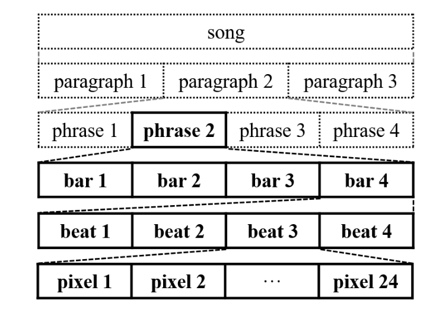
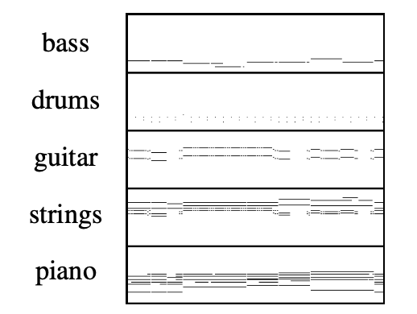
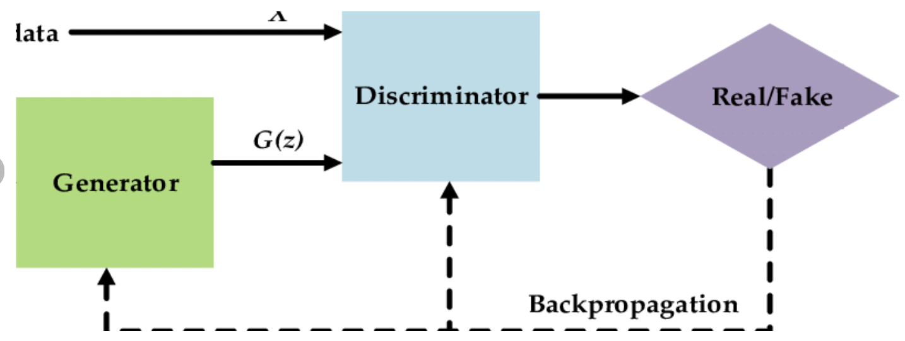
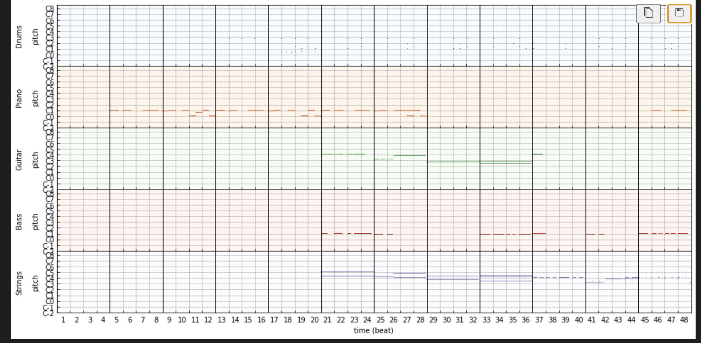
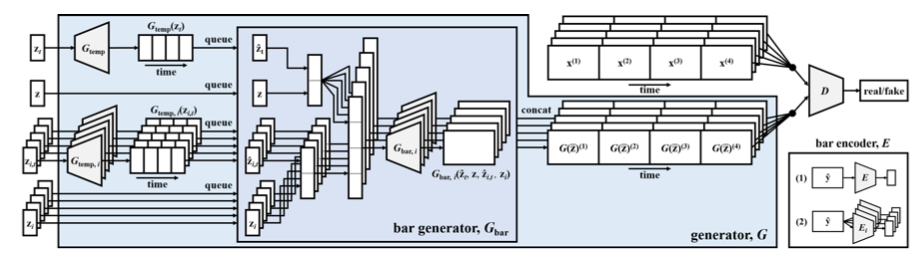

# MuseGAN_Music_Generation
Automatic Music Generation using Multi-track Sequential Generative Adversarial Networks.
____________________________________________
## Introduction
- This project aims at generating polyphonic(i.e. Multitrack) music using **Generative Adversarial Networks**.
- Music has a hierarchical structure, with higher-level building blocks(i.e. a phrase) made up of smaller recurrent patterns(i.e. bars/ pixels). We will be using bars as the basic unit.
    

- Music can have multiple tracks(differnt instruments) but the ones we'll be focusing on encompasses 'Strings', 'bass', 'guitar', 'paino' and 'drums'.
    

## Generative Adversarial Networks
- The basic concept is to achieve adversarial learning with the help of 2 networks namely:
    * GENERATOR : Maps random noise z sampled from a prior distribution to the data records.
    * DISCRIMINATOR : Distinguishes real data from the generated samples.
- The goal is to fool the discriminator by training the generator.
- The training can be formally modeled as a 2 player minmax game between the generator G and discriminator D:
    >$\min_{G}\max_{D}E_{x \approx p_{d}}[log(D(x))] + E_{z \approx p_{z}}[1-log(D(G(z)))]$, where $p_{d},p_{z}$ represents the distribution of real data and prior distribution of z.
- Basic understanding of GAN-
    

## Dataset
- The dataset used is a part of **Lakh MIDI dataset**, a large collection of 176,581 unique midi files.
- I used a preprocessed dataset called **LPD-5-cleansed dataset**.
- Key features of dataset includes:
    - Structural feature based segmentation.
    - prune to 4-bar phrases.
    - contains 84 possible pitches.
- [Link to dataset](https://drive.google.com/uc?id=11rxrGaQbfTW-WC0k2GlR9YDAT-UxIb4O)
- Snippet of the dataset, where each horizontal bar indicated that a particular string was played
    

## System Diagram for Model:
- Generator Block consists of:
    - ConvTrans3D
    - BatchNorm3d
- Discriminator block consist of:
    - Conv3d
    - LayerNorm

## Contributions:
- [Shrikant Kendre](https://github.com/shriawesome)

## Resources
- [Lakh Midi Dataset](https://salu133445.github.io/lakh-pianoroll-dataset/)
- [MuseGAN Research Paper](https://arxiv.org/abs/1709.06298)

